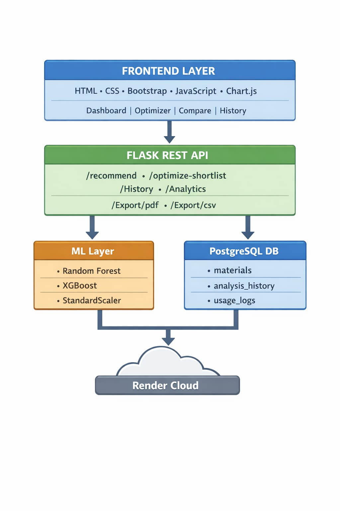
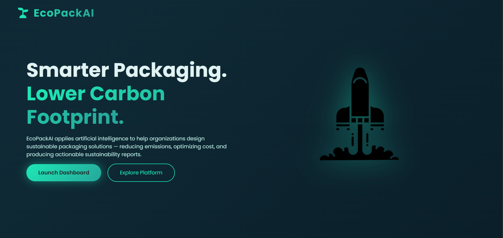
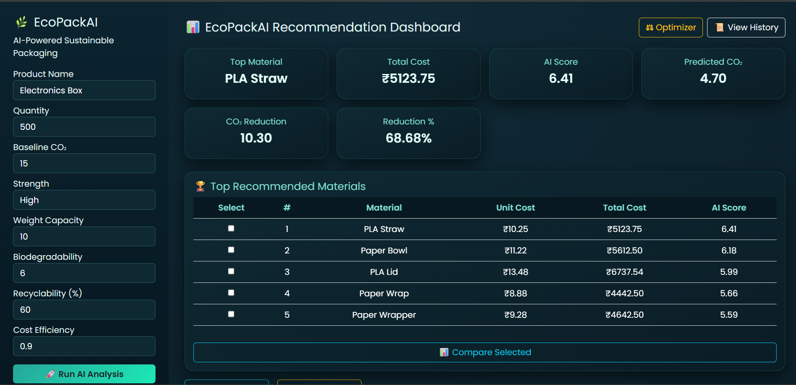
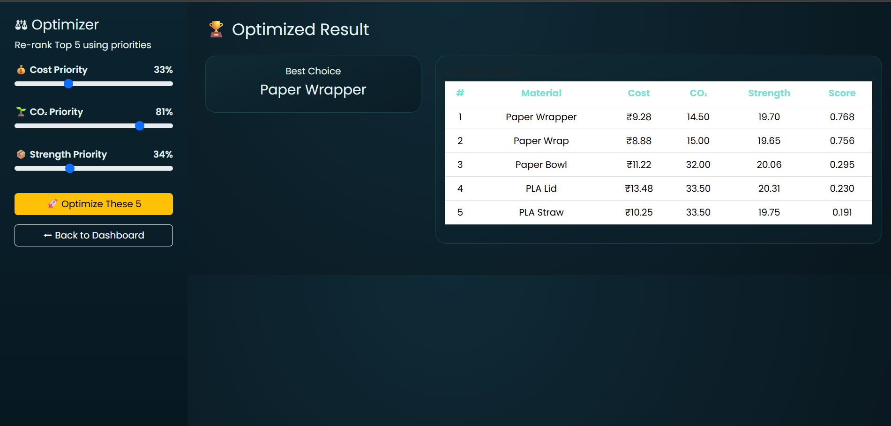
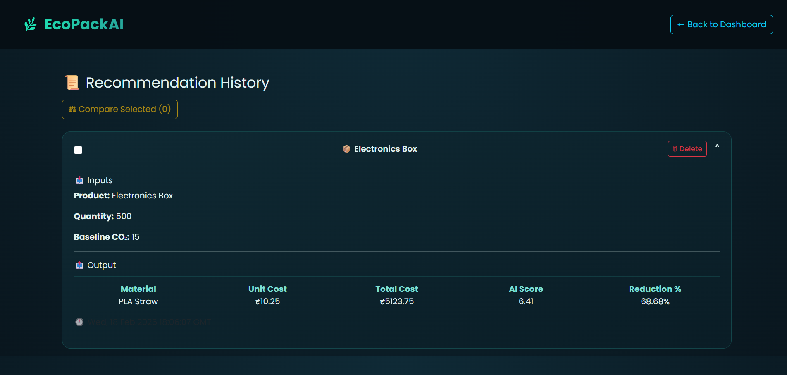

🌿 EcoPackAI
---

     
    🌿 EcoPackAI AI-Powered Sustainable Packaging Optimization System

---

EcoPackAI is a full-stack AI-driven decision support system designed to recommend sustainable packaging materials by optimizing Cost, CO₂ Emission, and Structural Strength simultaneously.

The system integrates:

    Machine Learning Models

    Multi-Objective Optimization

    Real-Time Analytics Dashboard

    Cloud Deployment

    Automated Report Generation

This project demonstrates practical implementation of Artificial Intelligence in environmental sustainability.

---

🌐 Live Deployment
---

🔗 Hosted on Render Cloud:
👉 https://ecopackai-ai-powere-sustinable-packing-9nz6.onrender.com

    ✔ Production environment

    ✔ PostgreSQL cloud database

    ✔ REST API integration

    ✔ Fully functional UI

---

🎯 Problem Statement
---

In today’s rapidly expanding industrial and e-commerce ecosystem, packaging plays a critical role in product safety, logistics, branding, and customer satisfaction. However, most organizations still rely on traditional packaging materials without performing structured environmental or cost analysis. This leads to excessive carbon emissions, increased operational costs, poor recyclability practices, and limited sustainability awareness.

One of the major challenges faced by industries is the absence of an intelligent decision-support system that can simultaneously evaluate multiple packaging factors such as structural strength, cost efficiency, biodegradability, recyclability, and carbon footprint. Businesses often struggle to balance environmental responsibility with financial constraints because there is no data-driven framework to compare material alternatives quantitatively.

Additionally, sustainable packaging decisions require multi-objective optimization. A material that is environmentally friendly may be expensive. A low-cost material may produce high CO₂ emissions. Strong materials may not be biodegradable. Without a systematic evaluation method, organizations are forced to make subjective or experience-based decisions rather than analytical ones.

Furthermore, small and medium enterprises lack access to advanced AI tools that can predict environmental impact, calculate cost-benefit trade-offs, and provide ranked recommendations tailored to specific product requirements.

Therefore, there is a clear need for an AI-powered intelligent system that can:

Analyze packaging materials using measurable sustainability metrics

Predict cost and environmental impact using machine learning

Optimize multiple objectives simultaneously

Provide transparent comparison dashboards

Assist organizations in making environmentally responsible and economically viable packaging decisions

EcoPackAI addresses this gap by building a production-ready, cloud-deployed AI framework that transforms packaging selection into a data-driven optimization problem.

---

💡 Proposed Solution
---

EcoPackAI provides an AI-powered optimization framework that:

Develop an AI-powered packaging recommendation system that suggests sustainable materials based on product requirements.

Use Machine Learning models (Random Forest / XGBoost) to predict cost, CO₂ impact, and material suitability.

Apply multi-objective optimization to balance cost efficiency, environmental impact, and strength.

Provide Top 5 ranked material recommendations with AI scores and detailed comparison.

Enable CO₂ reduction and cost savings analysis against baseline packaging.

Build an interactive Dashboard with charts and analytics for better decision-making.

Maintain history tracking and usage analytics using PostgreSQL database.

Offer PDF and CSV export functionality for professional reporting.

Deploy the system on Render Cloud for real-world accessibility and scalability.

This solution ensures businesses can adopt eco-friendly packaging in a data-driven, cost-effective, and environmentally responsible manner. 🌱
---

✨ Key Features
---

    🤖 AI-Based Recommendation Engine (Random Forest + XGBoost)

    🌱 CO₂ Impact & Sustainability Analysis

    💰 Cost Prediction & Optimization

    ⚖ Multi-Objective Optimizer (Cost vs CO₂ vs Strength)

    🗂 Recommendation History Tracking (stored in PostgreSQL)
    
    🗑 History Management with Delete Option

    📊 Interactive Dashboard with Charts

    📈 Material Comparison Module

    🧾 CSV & PDF Export Reports

    🗄 PostgreSQL Data Logging & Analytics

    ☁ Cloud Deployment on Render

---

📊 Innovation Highlights
---

    🧠 AI-Driven Sustainable Decision Engine combining ML with real-world packaging metrics

    ⚖ Multi-Objective Optimization allowing dynamic trade-offs between Cost, CO₂, and Strength

    📊 Interactive Comparison Dashboard for data-driven material selection

    🌍 CO₂ Reduction Analytics with measurable environmental impact tracking

    ☁ Cloud-Native Architecture (Render + PostgreSQL) for scalable deployment

    🔁 End-to-End Intelligent Workflow from recommendation → optimization → analytics → export

---

Here is a clean, professional Technology Stack section (short & distinction-ready) 👇

---

🛠 Technology Stack
---

💻 Frontend

    HTML5

    CSS3

    Bootstrap 5

    JavaScript (ES6)

    Chart.js (Data Visualization)

⚙ Backend

    Python 3.11

    Flask (REST API)

    Flask-CORS

🤖 Machine Learning

    scikit-learn

    XGBoost

    Pandas

    NumPy

    Joblib (Model Serialization)

    StandardScaler (Feature Normalization)

🗄 Database

    PostgreSQL

    SQLAlchemy (ORM)

☁ Deployment

    Render Cloud Platform

    Gunicorn (Production Server)

🔧 Tools & Version Control

    Git & GitHub

    VS Code

    ThunderClient (API Testing)

---
🏗️ System Architecture
---
EcoPackAI follows a layered full-stack architecture integrating Frontend, Backend API, Machine Learning, and Database components, deployed on cloud infrastructure.

---

🔹 1. Frontend Layer (User Interface)

Built using HTML, CSS, Bootstrap, JavaScript

Interactive charts powered by Chart.js

Pages:

Dashboard – AI recommendations & analytics

Optimizer – Multi-objective ranking

Compare – Side-by-side material comparison

History – Past recommendation tracking

Communicates with backend via REST API (JSON)

---

🔹 2. Backend Layer (Flask REST API)

Developed using Flask (Python)

Handles:

/recommend – AI material prediction

/optimize-shortlist – Multi-objective optimizer

/history – Fetch past analysis

/analytics – Usage insights

/export/pdf, /export/csv – Report generation

Performs:

Input validation

Business logic processing

ML model inference

Database operations

---

🔹 3. Machine Learning Layer

Algorithms:

    Random Forest

    XGBoost

Models predict:

    CO₂ emissions

    Material cost

    AI recommendation score

    Uses StandardScaler for feature normalization

Implements Multi-Objective Optimization:

    Cost Priority

    CO₂ Priority

    Strength Priority

---

🔹 4. Database Layer (PostgreSQL)

Stores structured data:

materials – Packaging material properties

analysis_history – Past AI results

usage_logs – Material recommendation frequency

Ensures data persistence, analytics tracking, and performance monitoring.

---

🔹 5. Deployment Layer (Cloud)

Hosted on Render Cloud

Backend deployed as Web Service

PostgreSQL managed database

Accessible via public live URL

---

🔄 Architecture Flow

           User
            ↓  
    Frontend (Dashboard/UI)
            ↓
    Flask REST API
            ↓
    ML Models + Optimizer
            ↓
    PostgreSQL Database (Render Managed DB)
            ↓
    Response (JSON)
            ↓
    Charts & Analytics Visualization

---

📌 Architecture Image 
---

    

This architecture ensures scalability, maintainability, performance efficiency, and real-world deployment readiness, making EcoPackAI a production-level AI solution.

📁 Project Structure
---
    PROJECT ECOPACKAI
    │
    ├── 📁 backend
    │   ├── 📁 __pycache__
    │   ├── 📁 exports
    │   ├── 📁 logs
    │   ├── 📁 models
    │   ├── 📄 .env
    │   ├── 🐍 app.py
    │   └── 🐍 load_csv_to_db.py
    │
    ├── 📁 data
    │   ├── 📄 material_dataset.csv
    │   ├── 📄 materials_module2_final.csv
    │   ├── 📄 product_dataset.csv
    │   └── 📄 products_module2_final.csv
    │
    ├── 📁 frontend
    │   ├── 📄 compare.html
    │   ├── 📄 dashboard.html
    │   ├── 📄 history.html
    │   ├── 📄 index.html
    │   └── 📄 optimizer.html
    │
    ├── 📁 npy files
    │   ├── 📄 X_test.npy
    │   ├── 📄 X_train.npy
    │   ├── 📄 y_co2_test.npy
    │   ├── 📄 y_co2_train.npy
    │   ├── 📄 y_cost_test.npy
    │   └── 📄 y_cost_train.npy
    │
    ├── 📁 python files
    │   ├── 📓 data_cleaning and feature_eng.ipynb
    │   ├── 📓 ml_model_training.ipynb
    │   └── 📓 ml_preparation.ipynb
    │
    ├── 📁 screenshots
    │   ├── 📁 module2_sc
    │   ├── 📁 module3_sc
    │   ├── 📁 module4_sc
    │   ├── 📁 module5_sc
    │   ├── 📁 module6_sc
    │   ├── 📜dashboard_page.png
    │   ├── 📜history_page.png
    │   ├── 📜landing_page.png
    │   ├── 📜optimizer_page.png
    │   └── 📜system-architecture.jpeg
    │
    ├── 📄 .gitignore
    ├── 📄 one.txt
    └── 📄 readme.md

---
🧠 Modules (1–8 Detailed Implementation)
---

📘 Module 1 – Problem Identification & Research
---

Conducted research on sustainable packaging challenges.

Identified optimization gap between cost and environmental impact.

Defined system objective: Multi-objective AI-based recommendation engine.

Finalized evaluation metrics: CO₂ reduction, cost efficiency, strength suitability.

---

📘 Module 2 – Data Collection & Preparation
---

Created structured dataset of packaging materials.

Included features:

    Strength

    Weight Capacity

    Biodegradability

    Recyclability

    Cost per unit

    CO₂ emission data

    Cleaned and standardized dataset.

    Stored data in PostgreSQL database.

---

📘 Module 3 – Feature Engineering
---

Designed normalized scoring functions.

Computed eco-impact indicators.

Implemented data scaling using StandardScaler.

Prepared structured feature columns for ML models.

---

📘 Module 4 – Machine Learning Model Development
---

Trained Random Forest model for cost prediction.

Trained XGBoost model for CO₂ estimation.

Evaluated models using regression metrics.

Serialized models using joblib.

Integrated model loading into Flask backend.

---

📘 Module 5 – Backend API Development
---

Designed RESTful endpoints.

Implemented input validation.

Integrated ML model predictions.

Added error handling & logging.

Created PDF and CSV export functionality.

---

📘 Module 6 – Frontend Interface Development
---

Designed responsive UI using Bootstrap.

Created dashboard analytics view.

Integrated Chart.js for:

    Cost Comparison

    AI Score Trends

    Material Usage

Implemented localStorage for inter-page data transfer.

Developed compare module for multi-selection visualization.

---

📘 Module 7 – Multi-Objective Optimization Engine
---

Developed weighted scoring algorithm.

Enabled user-defined priorities:

    Cost weight

    CO₂ weight

    Strength weight

Implemented normalization logic.

Created optimizer page for re-ranking top 5 results.

Designed decision-support framework.

---

📘 Module 8 – Deployment, Testing & Validation
---

Deployed backend on Render.

Connected cloud PostgreSQL database.

Performed integration testing.

Conducted UI testing and validation.

Ensured production stability.

---

Screenshots
---

---

🖥️ Live Application Preview

 🔹 Landing Page
    

 🔹 Dashboard Page
    

 🔹 Optimizer Page
    

 🔹 Compare Materials Page
    

 🔹 History & Analytics Page
    

---
🔮 Future Enhancements
---

    🌍 Real-time carbon footprint tracking dashboard

    ⚖ Pareto-based multi-objective optimization (Cost vs CO₂ vs Strength)

    📊 Advanced 3D visualization and sustainability analytics

    🧠 AI Policy Advisor for ESG and green compliance guidance

    🏭 Supplier integration with real-time pricing

    📦 Lifecycle Assessment (LCA) impact analysis

    🔐 User authentication with role-based access

    📱 Mobile application for on-site packaging decisions

    🌐 API integration with e-commerce platforms

    ☁ Automated model retraining and cloud scalability

---

👨‍💻 Developer Portfolio
---

Name: Esakki Raja

Role: Full-Stack AI Developer

Skills Demonstrated:

    Machine Learning Integration

    REST API Development

    Database Design

    Cloud Deployment

    Frontend Data Visualization

    Optimization Algorithm Design

This project demonstrates the ability to build, deploy, and scale AI-powered web systems independently.

---

Here is a professional, distinction-level final conclusion + evaluator closing statement you can directly paste into your README or report.

---

🎯 Final Conclusion
---

EcoPackAI successfully demonstrates how Artificial Intelligence can be applied to solve real-world sustainability challenges in packaging selection and optimization. By integrating machine learning models, multi-objective optimization, data analytics, and cloud deployment, the system provides intelligent, data-driven recommendations that balance environmental impact, cost efficiency, and material performance.

The project goes beyond a basic ML prototype by implementing a complete full-stack architecture, including a responsive frontend, RESTful Flask backend, PostgreSQL database management, analytics dashboard, optimizer module, comparison engine, history tracking with deletion functionality, and exportable reporting. Deployment on Render Cloud ensures production-level accessibility and scalability.

EcoPackAI represents a practical, industry-relevant solution that combines AI innovation with sustainability impact, demonstrating both strong technical implementation and real-world applicability.

---

🏢 Internship Information
---
    Organization: Infosys Springboard

    Domain: Artificial Intelligence & Machine Learning

    Duration: 8 Weeks

    Deployment: Render Cloud

    Developer: Esakki Raja Salaikumar

---
🎓 Internship Learning Outcomes
---
    Applied Machine Learning in a production-ready system

    Designed scalable REST APIs using Flask

    Integrated PostgreSQL with cloud deployment

    Implemented multi-objective optimization logic

    Built real-time analytics dashboards

    Deployed full-stack application on Render Cloud

---

🏆 Project Final Closing Statement
---

EcoPackAI is not just a machine learning model, but a fully deployed intelligent decision-support system that integrates AI, optimization, analytics, and cloud infrastructure into a cohesive real-world solution. The project reflects strong problem understanding, technical depth, system design capability, and professional deployment standards.

This submission demonstrates innovation, completeness, scalability, and practical impact — meeting distinction-level expectations for a top-rank AI project.

---
